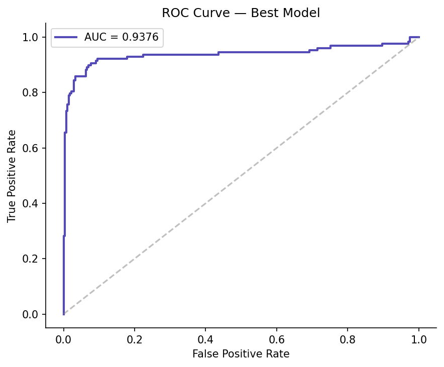
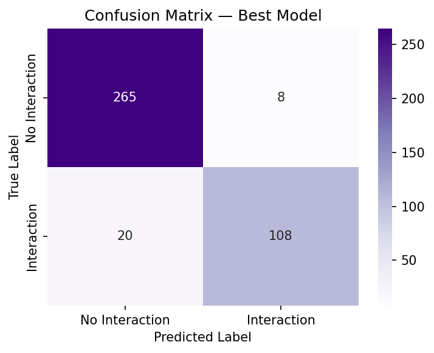
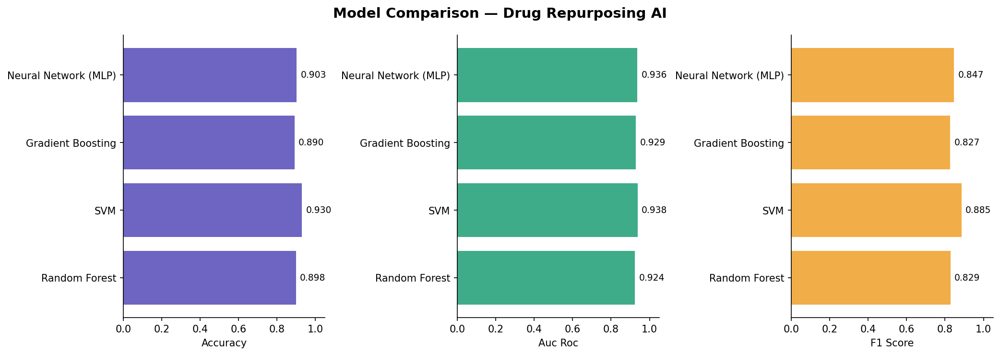

# 💊 AI-Based Drug Repurposing Prediction System

**Predicting new therapeutic uses for existing FDA-approved drugs, using machine learning.**

> M.Tech Final Year Project — Computer Science & Engineering
> Maulana Abul Kalam Azad University of Technology (MAKAUT), West Bengal


🔗 **Live Demo:** [Add your Streamlit Cloud URL here after deploying]

---

## 📖 Overview

Drug repurposing — finding new therapeutic uses for drugs that are already approved and on the market — is one of the fastest, cheapest ways to bring treatments to patients, since the safety profile of the drug is already known. This project builds a full machine learning pipeline that predicts whether a given **drug–disease pair** is a plausible repurposing candidate, based on molecular, pharmacokinetic, and pathway-level features.

The system trains and compares four classifiers, selects the best-performing model, and serves predictions through an interactive Streamlit web app — complete with single-pair prediction, batch analysis across diseases, and a model performance dashboard.

## ✨ Features

- 🔬 **Single Prediction** — pick a drug and disease, tune molecular features with sliders, and get a repurposing probability with a confidence rating
- 🔁 **Batch Analysis** — rank all candidate diseases for a chosen drug by repurposing potential
- 📊 **Model Performance Dashboard** — live view of accuracy, AUC-ROC, F1, and cross-validation scores for every model trained
- ✅ **Validated pair recognition** — known, clinically-documented repurposing cases (e.g. Metformin → Breast Cancer) are flagged automatically
- 🎨 Clean, custom-styled UI (not default Streamlit theming)

## 🧠 How It Works

```
Synthetic dataset generation
        ↓
22 engineered features (molecular, pharmacokinetic, pathway, disease-level)
        ↓
Train/test split + SMOTE (class balancing)
        ↓
Train 4 models: Random Forest · SVM · Gradient Boosting · MLP
        ↓
5-fold cross-validation → pick best model by AUC-ROC
        ↓
Serve via Streamlit (app/app.py)
```

**Feature set (22 total):** molecular weight, LogP, H-bond donors/acceptors, rotatable bonds, polar surface area, binding affinity, bioavailability, half-life, toxicity, solubility, drug class, five pathway-involvement scores (inflammation, metabolism, apoptosis, angiogenesis, immunity), genetic risk, disease severity, prevalence, age of onset, and comorbidity.

## 📊 Model Performance

| Model | Accuracy | AUC-ROC | F1 Score | CV AUC (mean ± std) |
|---|---|---|---|---|
| **SVM** 🏆 | 0.930 | **0.938** | 0.885 | 0.970 ± 0.013 |
| Neural Network (MLP) | 0.903 | 0.936 | 0.847 | 0.970 ± 0.013 |
| Gradient Boosting | 0.890 | 0.929 | 0.827 | 0.971 ± 0.011 |
| Random Forest | 0.898 | 0.924 | 0.829 | 0.970 ± 0.014 |

**SVM (RBF kernel)** was selected as the best model, deployed as `models/best_model.pkl`. Full metrics are in [`results/results_summary.json`](results/results_summary.json).

<p align="center">
  
  
</p>
<p align="center">
  
</p>

## ✅ Validated Repurposing Pairs

These clinically-documented repurposing cases are embedded in the dataset as ground truth, and are flagged with a ✅ in the app when predicted:

| Drug | Disease | Evidence |
|---|---|---|
| Metformin | Breast Cancer | Actively investigated as an anti-cancer agent |
| Metformin | Colorectal Cancer | Multiple trials show reduced cancer risk |
| Aspirin | Colorectal Cancer | Recognized chemopreventive agent |
| Sildenafil | Coronary Artery Disease | Originally developed for CAD (before Viagra) |
| Imatinib | Leukemia | Landmark repurposing case (Gleevec, CML) |
| Rituximab | Rheumatoid Arthritis | Repurposed from lymphoma treatment |
| Adalimumab | Psoriasis | Approved for both RA and psoriasis |
| Methotrexate | Rheumatoid Arthritis | Originally a cancer drug, now first-line for RA |

## 🗂 Project Structure

```
drug-repurposing-ai/
├── app/
│   └── app.py                       ← Streamlit web app (inference + dashboard)
├── data/
│   └── drug_disease_interactions.csv
├── models/
│   ├── best_model.pkl                ← SVM, selected on AUC-ROC
│   ├── scaler.pkl
│   ├── SVM.pkl
│   ├── Random_Forest.pkl
│   ├── Gradient_Boosting.pkl
│   └── Neural_Network_MLP.pkl
├── results/
│   ├── results_summary.json
│   ├── roc_curve.png
│   ├── confusion_matrix.png
│   └── model_comparison.png
├── src/
│   ├── generate_data.py             ← synthetic dataset generator
│   └── train.py                     ← training + evaluation pipeline
├── requirements.txt                 ← app/runtime dependencies
├── requirements-train.txt           ← extra deps for retraining only
└── README.md
```

## ⚙️ Tech Stack

- **Python 3.9+**
- **scikit-learn** — Random Forest, SVM, Gradient Boosting, MLP
- **imbalanced-learn (SMOTE)** — class balancing
- **SHAP** — model explainability
- **Streamlit** — web app / demo UI
- **pandas, numpy, joblib**

## 🚀 Setup & Run Locally

```bash
# 1. Clone the repo
git clone https://github.com/<your-username>/drug-repurposing-ai.git
cd drug-repurposing-ai

# 2. Install app dependencies
pip install -r requirements.txt

# 3. Launch the app (uses the pre-trained models already in models/)
streamlit run app/app.py
```

To regenerate the dataset or retrain models from scratch:

```bash
pip install -r requirements.txt -r requirements-train.txt
python src/generate_data.py
python src/train.py
```

## ⚠️ Limitations & Disclaimer

This project uses a **synthetically generated dataset** built to reflect realistic feature distributions and known repurposing biology — it is a machine learning proof-of-concept for a final-year academic submission, **not** a validated clinical or pharmacological tool. Predictions should not be used for real drug development, prescribing, or medical decision-making.

## 🔮 Future Improvements

- Swap synthetic data for a real bioactivity source (e.g. DrugBank, ChEMBL)
- Surface SHAP explanations directly in the app UI, per-prediction
- Graph-based models (drug–target–disease network embeddings)
- User-uploadable batch CSV predictions

## 👤 Author

**Aditya Ray**
M.Tech, Computer Science & Engineering — MAKAUT, West Bengal

---

<p align="center">Built with scikit-learn + Streamlit</p>
